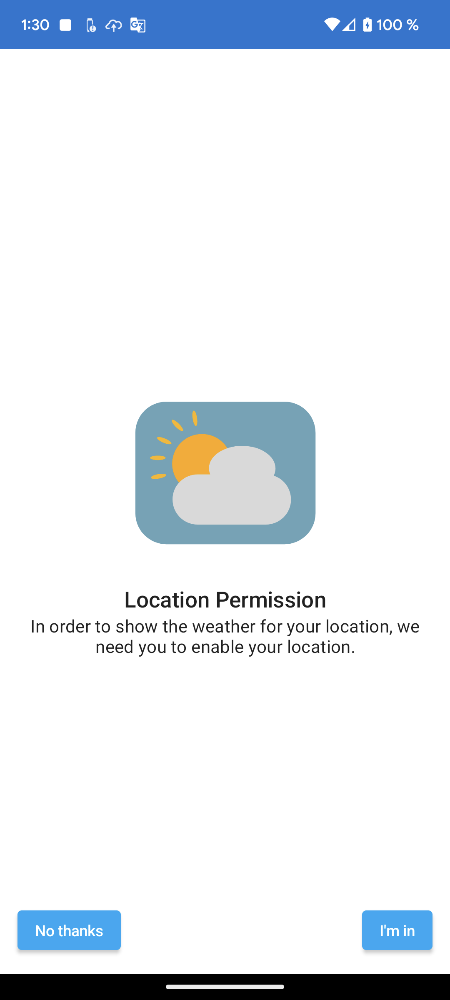
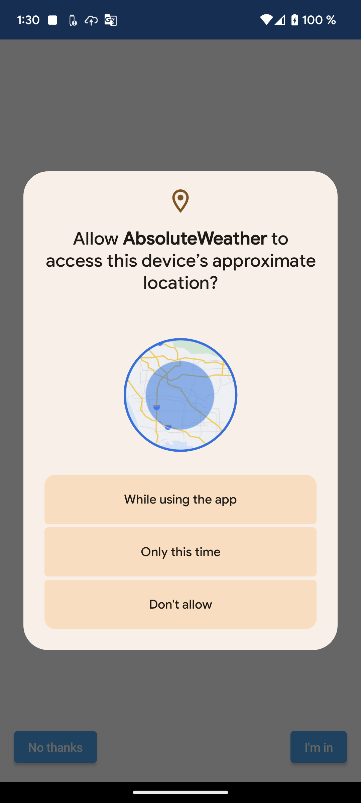
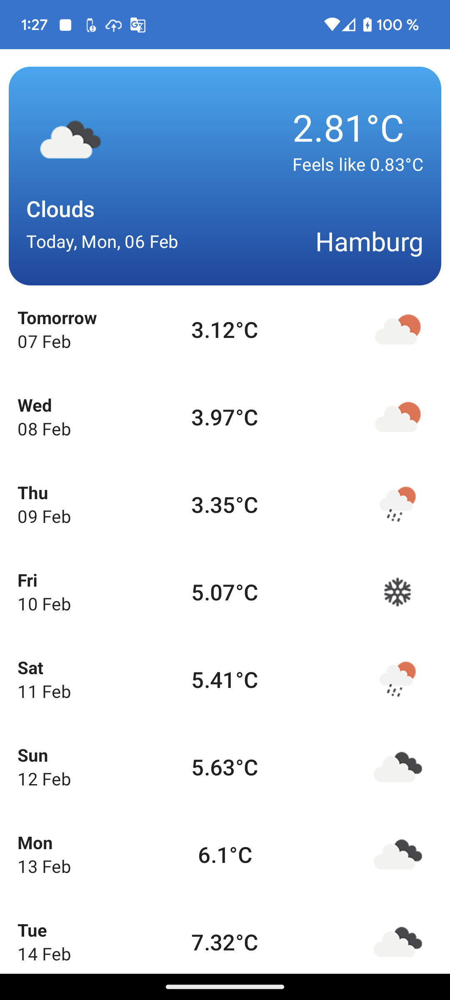
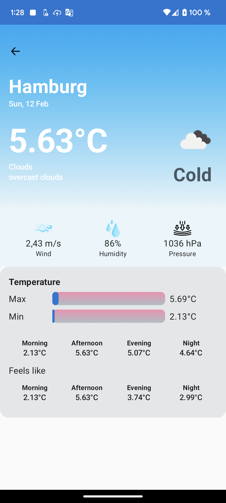

## Prerequisite
> It's assumed you have  [Android Studio](https://developer.android.com/studio?gclid=CjwKCAjw_ISWBhBkEiwAdqxb9kQK1LFtDkAS6AFU-ZCrzGpaFDed5-DYMMbisxO2YZ8uzx2vv6fn8xoCjWAQAvD_BwE&gclsrc=aw.ds)  installed.
## How to Build
* Clone the project to your local machine and open with Android studio.
	* ### Android
		* [Open weather API](https://openweathermap.org/api) requires appId, add your appId in com.lek.data.repository.WeatherRepository. Replace the empty string for appId with your appId.
	    * Internet is required so please turn on your internet before building.
		* Let Android studio download dependencies.
		* Run the app Configuration. 
 
 ## Project Description
  **AbsoluteWeather** Is a weather update Android application. App shows notification update within 15 minutes interval. 
  
#### Images from Android

### Project Structure

 ### Architecture
 The Project is built using the [Clean Architecture](https://developer.android.com/topic/architecture?gclid=CjwKCAjw_ISWBhBkEiwAdqxb9i24YwlLSa_1H2Fvx9Ul4hQ0p4j7Gh7awjnS8BER1O8u8KH7BK8OFxoCSmsQAvD_BwE&gclsrc=aw.ds). 
 * For Presentation, the project used [MVVM Architecture](https://developer.android.com/topic/architecture)
### Tools

* [Kotlin Language](https://kotlinlang.org/)
* [Room Database](https://developer.android.com/training/data-storage/room)
* [Retrofit for Api Request](https://github.com/square/retrofit)
* [Work Manager for background service and notification](https://developer.android.com/topic/libraries/architecture/workmanager?gclid=Cj0KCQiA54KfBhCKARIsAJzSrdq66-L4pimBaxsKC7-pQNXZlzwuVciKnSw6pjc50nrlPrxCeO0BJE0aAkgtEALw_wcB&gclsrc=aw.ds)
* [Jetpack Compose UI](https://developer.android.com/jetpack/compose?gclid=CjwKCAjw_ISWBhBkEiwAdqxb9nzoYY4WLAU43nlDB8IQzOF35aFSFWex9lNGAYJICk40shwaF8lodhoCkWkQAvD_BwE&gclsrc=aw.ds)
* [Jetpack ViewModel](https://developer.android.com/topic/libraries/architecture/viewmodel?gclid=CjwKCAjw_ISWBhBkEiwAdqxb9myAeiqd-W8rKzPejJuUSdsCVDPTjWkgw8c_80zRF8ZD1gLI07KtLBoCUm8QAvD_BwE&gclsrc=aw.ds)

### TODOS
* Handle internet connectivity. Notify the user about internet connection status.
* Add UI tests